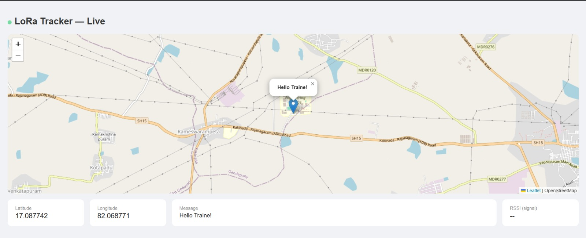
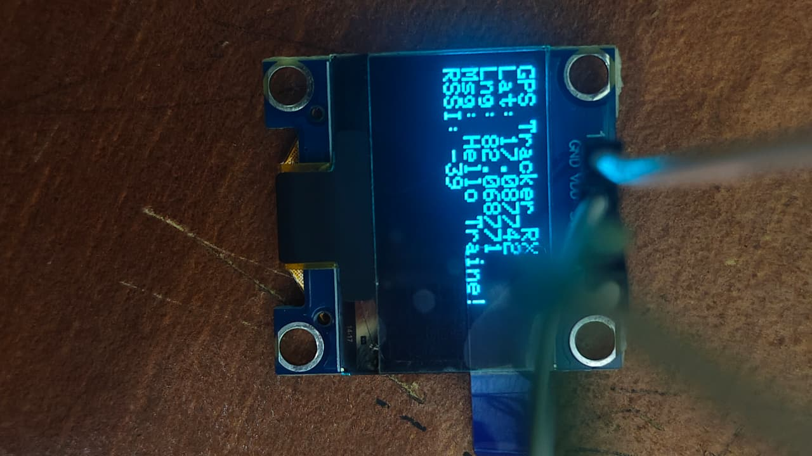

<div align="center">

# 📡 LoRa GPS Long Distance Tracker


<br/>


<br/><br/>


> **Transmit GPS coordinates and text messages wirelessly over 2–5 km**
> No internet. No SIM card. No infrastructure needed.
> Receiver plots the **exact road route** using offline Dijkstra on an OSM graph.
> Built as a B.Tech ECE project at **Aditya University, Surampalem** 🎓

<br/>


</div>

---

<div align="center">

## 🌟 Star History

[](https://star-history.com/#SanjaySurampudi/lora-gps-tracker&Date)

</div>

---

## 🗺️ Live Demo

<div align="center">

| 🌐 Web Dashboard | 📟 OLED Display |
|:---:|:---:|
|  |  |
| Real-time map with exact road route + GPS track history | Coordinates + Message + RSSI (dBm) |

</div>

---

## ✨ Features

<div align="center">

| Feature | Details |
|---|---|
| 📡 **Wireless Range** | 2–5 km line of sight at 433 MHz |
| 🛰️ **GPS Tracking** | Real coordinates from NEO-6M via TinyGPS++ |
| 💬 **Text Messaging** | Send custom text alongside GPS coordinates |
| 🗺️ **Exact Road Route** | Offline Dijkstra on OSMnx — real driving path, not straight line |
| 📊 **RSSI Display** | Signal strength shown live on dashboard and OLED |
| 🔵 **GPS Track History** | Dotted trail of all past TX positions on map |
| 🌐 **Live Web Dashboard** | Interactive OpenStreetMap, auto-updates every 3 seconds |
| 📟 **OLED Display** | Shows lat, lng, message, RSSI on receiver instantly |
| 🐍 **Modular Python Server** | Clean: `serial_reader`, `router`, `flask_routes`, `app` |
| 🔌 **Fully Offline Routing** | OSM graph downloaded once — no internet needed after |
| 🛡️ **Packet Filtering** | Corrupted LoRa packets auto-filtered by server |

</div>

---

## 🏗️ System Architecture

```
╔══════════════════════════════╗                ╔══════════════════════════════╗
║       TRANSMITTER SIDE       ║                ║        RECEIVER SIDE         ║
║                              ║                ║                              ║
║  ┌─────────┐                 ║                ║        ┌──────────────────┐  ║
║  │ NEO-6M  │  UART (pins3,4) ║                ║        │  OLED SSD1306    │  ║
║  │   GPS   │──────────────►  ║                ║        │  (I2C · A4/A5)   │  ║
║  └─────────┘                 ║                ║        └──────────────────┘  ║
║       │ TinyGPS++            ║                ║                ▲             ║
║       ▼                      ║                ║                │ I2C         ║
║  ┌───────────┐               ║                ║       ┌────────────────┐     ║
║  │  Arduino  │               ║   433 MHz RF   ║       │  Arduino UNO   │     ║
║  │    UNO    │════════════════════════════════════════►│   (Receiver)   │     ║
║  └───────────┘               ║                ║       └────────────────┘     ║
║       │ SPI                  ║                ║                │ SPI         ║
║       ▼                      ║                ║                ▼             ║
║  ┌──────────┐                ║                ║       ┌────────────────┐     ║
║  │  LoRa    │                ║                ║       │  LoRa SX1278   │     ║
║  │ SX1278   │  lat,lng,msg   ║                ║       │  + RSSI read   │     ║
║  └──────────┘                ║                ║       └────────────────┘     ║
╚══════════════════════════════╝                ║                │ USB Serial  ║
                                                ║                ▼             ║
                                                ║  ┌─────────────────────────┐ ║
                                                ║  │    Python Flask Server   │ ║
                                                ║  │                         │ ║
                                                ║  │  serial_reader.py       │ ║
                                                ║  │  ├─ reads DATA: packets │ ║
                                                ║  │  └─ parses RSSI field   │ ║
                                                ║  │                         │ ║
                                                ║  │  router.py              │ ║
                                                ║  │  ├─ OSMnx graph (once)  │ ║
                                                ║  │  └─ Dijkstra algorithm  │ ║
                                                ║  │                         │ ║
                                                ║  │  flask_routes.py        │ ║
                                                ║  │  ├─ /  (dashboard)      │ ║
                                                ║  │  ├─ /data  (TX state)   │ ║
                                                ║  │  ├─ /history (track)    │ ║
                                                ║  │  └─ /route (road path)  │ ║
                                                ║  │                         │ ║
                                                ║  │  app.py  (entry point)  │ ║
                                                ║  └─────────────────────────┘ ║
                                                ║                │             ║
                                                ║                ▼             ║
                                                ║       ┌────────────────┐     ║
                                                ║       │  Web Browser   │     ║
                                                ║       │ (Live Map +    │     ║
                                                ║       │  Road Route)   │     ║
                                                ║       └────────────────┘     ║
                                                ╚══════════════════════════════╝
```

---

## 🛒 Hardware Required

### 📤 Transmitter Side

| Component | Qty | Notes |
|---|---|---|
| Arduino UNO | 1 | Any clone works |
| GPS NEO-6M | 1 | Include ceramic antenna |
| LoRa SX1278 433 MHz | 1 | Include wire antenna |
| Breadboard + Jumper Wires | — | Male-to-male |

### 📥 Receiver Side

| Component | Qty | Notes |
|---|---|---|
| Arduino UNO | 1 | Any clone works |
| LoRa SX1278 433 MHz | 1 | Include wire antenna |
| OLED 0.96" SSD1306 I2C | 1 | 128×64 pixels |
| Breadboard + Jumper Wires | — | — |
| PC / Laptop | 1 | Runs Flask server |

---

## 🔌 Pin Connections

### LoRa SX1278 → Arduino UNO *(both TX and RX boards)*

> ⚠️ **Critical:** Power LoRa from **3.3V only**. Connecting to 5V will permanently damage the module!

| LoRa Pin | Arduino Pin |
|---|---|
| VCC | **3.3V** ⚠️ |
| GND | GND |
| SCK | 13 |
| MISO | 12 |
| MOSI | 11 |
| NSS (CS) | 10 |
| RST | 9 |
| DIO0 | 2 |

### GPS NEO-6M → Arduino UNO *(TX side only)*

| GPS Pin | Arduino Pin |
|---|---|
| VCC | 5V |
| GND | GND |
| TX | Pin 4 (SoftwareSerial RX) |
| RX | Pin 3 (SoftwareSerial TX) |

### OLED SSD1306 → Arduino UNO *(RX side only)*

| OLED Pin | Arduino Pin |
|---|---|
| VCC | 3.3V or 5V |
| GND | GND |
| SDA | A4 |
| SCL | A5 |

---

## 💾 Software Setup

### 1️⃣ Arduino Libraries

Open Arduino IDE → `Sketch → Include Library → Manage Libraries` and install:

```
✅ TinyGPS++          by Mikal Hart
✅ LoRa               by Sandeep Mistry
✅ Adafruit SSD1306   by Adafruit
✅ Adafruit GFX       by Adafruit
✅ SoftwareSerial     (built-in — no install needed)
```

### 2️⃣ Python Dependencies

```bash
pip install flask pyserial osmnx networkx requests
```

> 💡 `osmnx` downloads the road graph **once** from OpenStreetMap on first run.
> After that, all routing runs **fully offline** using Dijkstra's algorithm.

---

## 📂 Project Structure

```
lora_tracker/
│
├── 📄 app.py                  # Entry point — run this to start the server
├── 📄 serial_reader.py        # Serial port thread + DATA:/RSSI packet parser
├── 📄 router.py               # OSMnx graph download + offline Dijkstra routing
├── 📄 flask_routes.py         # All Flask URL handlers + HTML dashboard template
│
├── 📁 transmitter/
│   └── tx.ino                 # Upload to TX Arduino (GPS + LoRa side)
│
├── 📁 receiver/
│   └── rx.ino                 # Upload to RX Arduino (LoRa + OLED side)
│
├── 📁 assets/
│   ├── website_screenshot.png
│   ├── oled_display.png
│   └── hardware_setup.png
│
├── 📄 requirements.txt
└── 📄 README.md
```

---

## 🚀 How to Run

### Step 1 — Upload Arduino Code

```bash
# 1. Open transmitter/tx.ino in Arduino IDE
# 2. Connect TX Arduino → Tools → Port → select correct COM port
# 3. Click Upload → wait for "Done uploading"
# 4. Disconnect TX Arduino

# 5. Open receiver/rx.ino in Arduino IDE
# 6. Connect RX Arduino → select its COM port
# 7. Click Upload → wait for "Done uploading"
```

> ⚠️ Always **close Arduino Serial Monitor** before running `app.py` — they cannot share the same COM port!

### Step 2 — Configure the Server

Open `app.py` and set your receiver's fixed GPS location:

```python
RECEIVER_LAT = 17.087741   # your fixed receiver latitude
RECEIVER_LNG = 82.068771   # your fixed receiver longitude
SERIAL_PORT  = None        # None = auto-detect, or set "COM11" / "/dev/ttyUSB0"
OSM_RADIUS_M = 50_000      # road graph radius in metres (50 km default)
```

### Step 3 — Start the Web Server

```bash
python app.py
```

Expected terminal output:

```
==================================================
  LoRa Long Distance Tracker
  Open  http://localhost:5000
  Receiver: 17.087741, 82.068771
==================================================
INFO  serial_reader  Auto-detected serial port: COM11
INFO  serial_reader  Connected to COM11 — listening for DATA: packets
INFO  router         Downloading OSM road graph (radius=50000 m) …
INFO  router         OSM graph loaded: 18423 nodes, 42187 edges
INFO  serial_reader  RX  lat=17.385000 lng=78.486700 rssi=-87 | history=1 pts
```

> 💡 The OSM road graph downloads in the **background** on first run (10–60 sec).
> During that time the map shows a straight-line fallback with a note.
> Once loaded, it switches automatically to the real road route.

### Step 4 — Open the Dashboard

```
http://localhost:5000
```

🎉 A live map appears showing:

| Layer | Description |
|---|---|
| 🔴 Red dot | Transmitter — moves live with GPS |
| 🔵 Blue dot | Receiver — fixed position |
| 🟢 Green line | Exact road route via offline Dijkstra |
| 🟠 Orange dashed | Straight-line distance |
| 🔵 Dotted trail | Full GPS track history |

---

## 📦 Data Packet Format

```
TX sends over LoRa:      17.087742,82.068771,Hello from tracker!
RX forwards via Serial:  DATA:17.087742,82.068771,Hello from tracker!,RSSI:-65
Python server parses:    lat=17.087742  lng=82.068771  msg=...  rssi=-65 dBm
```

| Field | Example | Description |
|---|---|---|
| Latitude | `17.087742` | GPS latitude (6 decimal places) |
| Longitude | `82.068771` | GPS longitude (6 decimal places) |
| Message | `Hello from tracker!` | Custom text payload |
| RSSI | `-65` | Signal strength in dBm (shown live on dashboard) |

---

## 🔧 Key Improvements Over v1

<div align="center">

| # | Improvement | Details |
|:---:|---|---|
| 1️⃣ | **Exact Road Route** | Replaced straight-line map with offline Dijkstra on OSMnx road graph |
| 2️⃣ | **RSSI Fixed** | `rx.ino` appends `,RSSI:<value>` to serial — dashboard now shows real dBm |
| 3️⃣ | **Modular Python Code** | 4 clean modules, zero `__import__()` hacks |

</div>

---

## 🧪 Testing Without GPS

Test the full LoRa → Website pipeline using hardcoded coordinates in `tx.ino`:

```cpp
// Replace GPS read section with fixed test coordinates
float lat = 17.0877;
float lng = 82.0688;
String payload = String(lat, 6) + "," + String(lng, 6) + ",Test message!";
LoRa.beginPacket();
LoRa.print(payload);
LoRa.endPacket();
delay(3000);
```

---

## 🐛 Troubleshooting

| ❌ Problem | ✅ Fix |
|---|---|
| `Access is denied` on COM port | Close Arduino Serial Monitor — it blocks the port |
| `LoRa init failed!` | Check wiring — VCC must be **3.3V not 5V** |
| Dashboard shows "Waiting for LoRa data..." | Verify RX Arduino is connected and `rx.ino` is uploaded |
| RSSI shows `--` on dashboard | Re-upload the new `rx.ino` — old version didn't include RSSI |
| Map shows only straight line | OSM graph still loading — wait 10–60 sec, switches automatically |
| GPS no fix | Take module outdoors or near a window — cold fix takes 1–2 min |
| OLED shows nothing | Try I2C address `0x3D` instead of `0x3C` in `rx.ino` |
| Modules not communicating | Confirm both set to `433E6` and antennas are attached |
| `ModuleNotFoundError` | Run `pip install flask pyserial osmnx networkx requests` |
| Route not found after graph loads | Increase `OSM_RADIUS_M` in `app.py` (e.g. `150_000`) |

---

## 📊 Project Stats

<div align="center">

| Metric | Value |
|:---:|:---:|
| LoRa Frequency | 433 MHz |
| Wireless Range | 2–5 km (line of sight) |
| Update Interval | Every 3 seconds |
| Data Packet Size | ~40–60 bytes |
| TX Arduino Flash | ~53% (17,410 / 32,256 bytes) |
| TX Arduino RAM | ~33% (690 / 2,048 bytes) |
| End-to-end Latency | ~2–3 seconds |
| Python Modules | 4 (app, serial_reader, router, flask_routes) |
| Routing Method | Offline Dijkstra on OSMnx graph |

</div>

---

## 🔮 Future Improvements

- [ ] 🔐 AES-128 encryption for secure transmissions
- [ ] 📶 ESP8266/ESP32 for standalone WiFi dashboard (no PC needed)
- [ ] 🗺️ Multi-node tracking — monitor several transmitters on one map
- [ ] 💾 Persist OSMnx graph to disk so it doesn't re-download every run
- [ ] 💾 SQLite database to store and replay full GPS track history
- [ ] 📱 Mobile app (Flutter/React Native) for field use
- [ ] 🔋 Solar-powered transmitter for remote deployment
- [ ] 📲 SMS alert via GSM when tracker exits a geofence
- [ ] 🌐 Offline map tiles for fully internet-free map rendering

---

## 🎯 Use Cases

<div align="center">

| Use Case | Description |
|:---:|---|
| 🚨 Disaster Relief | Works when cell towers are down |
| 🌲 Forest Rangers | Track personnel in remote areas |
| 🎓 IoT Education | Learn LoRa, GPS, Arduino, Flask together |
| 🚗 Anti-theft Tracking | Vehicle tracking in rural/offline zones |
| 🏕️ Trekking Safety | Emergency beacon for hikers |
| ⚡ Zero Infrastructure | Works anywhere on Earth |

</div>

---

## 📚 References & Libraries

- [TinyGPS++](https://github.com/mikalhart/TinyGPSPlus) — GPS NMEA parser by Mikal Hart
- [Arduino LoRa](https://github.com/sandeepmistry/arduino-LoRa) — LoRa driver by Sandeep Mistry
- [Adafruit SSD1306](https://github.com/adafruit/Adafruit_SSD1306) — OLED display library
- [OSMnx](https://osmnx.readthedocs.io/) — OpenStreetMap road graph downloader by Geoff Boeing
- [NetworkX](https://networkx.org/) — Graph library used alongside OSMnx
- [Leaflet.js](https://leafletjs.com/) — Open-source interactive map library
- [OpenStreetMap](https://www.openstreetmap.org/) — Free map tile and road data provider
- [Flask](https://flask.palletsprojects.com/) — Lightweight Python web framework

---

## 📄 License

```
MIT License — Free to use, modify, and distribute with attribution.
```

---

<div align="center">


<br/>


<br/><br/>

*Built with ❤️, Arduino UNO, LoRa SX1278, GPS NEO-6M, and a lot of debugging*

---

### ⭐ If this project helped you, please give it a star on GitHub! ⭐

*Your support motivates further development* 🙏

</div>
